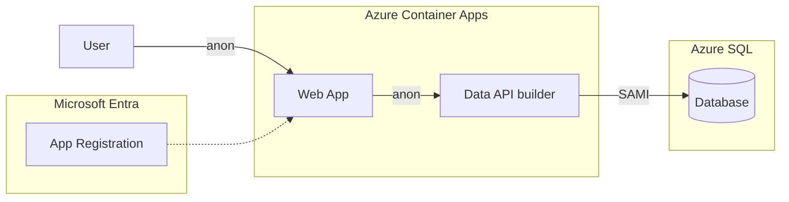

# Quickstart 3: Setting Up Entra ID

Introduces **Microsoft Entra ID** as the authentication provider on the API. The web app remains fully anonymous — no login UI and no MSAL in this quickstart.

The key change is on the API side: DAB is configured with an **EntraId** authentication provider and an **anonymous** role. An Entra ID app registration is created (audience + issuer), wiring up the auth infrastructure. Because the role is `anonymous`, the web app continues to work without bearer tokens.

This quickstart focuses on wiring authentication infrastructure at the API layer while keeping anonymous browser access.

## What You'll Learn

- Register an app in Entra ID for the API
- Configure DAB with the EntraId provider and an `anonymous` role
- Wire up app registration (audience / issuer) without changing the web app
- Prepare the auth infrastructure before adding login

## Auth Matrix

| Hop | Local | Azure |
|-----|-------|-------|
| User → Web | Anonymous | Anonymous |
| Web → API | Anonymous | Anonymous |
| API → SQL | SQL Auth | **SAMI** |

> **Key point:** The API has an Entra ID provider, but the anonymous role allows unauthenticated requests. Authentication infrastructure is present without requiring login in the browser.

## Architecture



> **Considerations on Auth Infrastructure**:
> The app registration and EntraId provider are in place, but the anonymous role means no token is required. This pattern lets you prepare auth infrastructure before enabling it — a common staging approach.

## Prerequisites

- [.NET 8 or later](https://dotnet.microsoft.com/download)
- [Aspire workload](https://learn.microsoft.com/dotnet/aspire/fundamentals/setup-tooling) — `dotnet workload install aspire`
- [Azure CLI](https://docs.microsoft.com/cli/azure/install-azure-cli) (for Entra ID setup)
- [Data API Builder CLI](https://learn.microsoft.com/azure/data-api-builder/) — `dotnet tool restore`
- [Docker Desktop](https://www.docker.com/products/docker-desktop/)
- [PowerShell](https://learn.microsoft.com/powershell/scripting/install/installing-powershell)

**Azure Permissions Required:** Create app registrations in Entra ID.

## Run Locally

```bash
dotnet tool restore
az login
dotnet run --project aspire-apphost
```

On first run, Aspire detects that Entra ID isn't configured and offers to run `azure/entra-setup.ps1` interactively. This creates the app registration, updates `dab-config.json` with the audience and issuer, then starts normally.

The web app loads anonymously with no login. Behind the scenes, DAB has an EntraId provider configured.

## Deploy to Azure

```bash
pwsh ./azure-infra/azure-up.ps1
```

The `preprovision` hook runs `entra-setup.ps1` automatically. During teardown via `azure-down.ps1`, the `postdown` hook runs `entra-teardown.ps1` to delete the app registration.

## Key Implementation Files

| File | Purpose |
|------|---------|
| `api/dab-config.json` | Defines EntraId auth provider with audience/issuer and `anonymous` role |
| `Aspire.AppHost/Demo.cs` | Checks for Entra placeholders in `dab-config.json` and guides setup |
| `azure-infra/entra-setup.ps1` | Creates app registration and API scope |
| `azure-infra/entra-teardown.ps1` | Deletes app registration on `azure-down` |

To tear down resources:

```bash
pwsh ./azure-infra/azure-down.ps1
```

> The web files (`index.html`, `app.js`, `dab.js`, `config.js`) stay anonymous in this quickstart. No MSAL, no login, and no bearer tokens are required in the browser.

